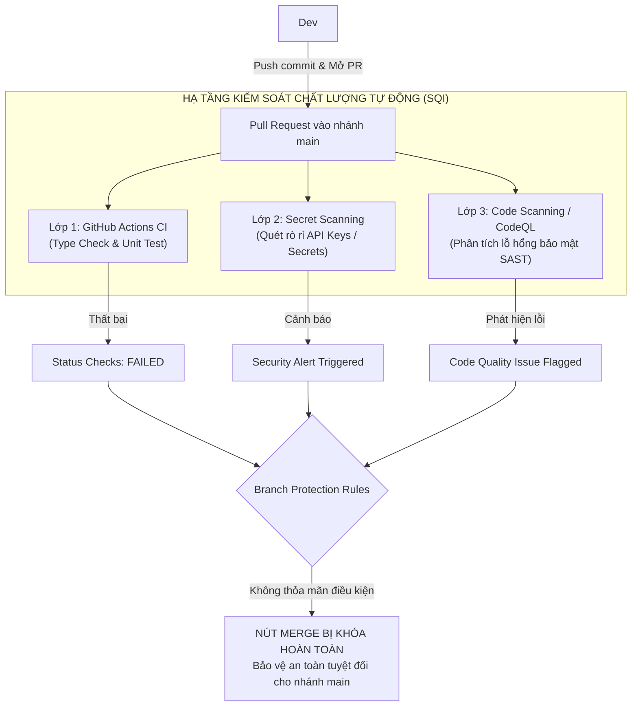

# Hướng Dẫn Thực Nghiệm: Hạ Tầng Đảm Bảo Chất Lượng Phần Mềm (SQI) & CI/CD Pipeline Trên GitHub Actions

> **Mục tiêu thực nghiệm:** Mô phỏng quy trình kiểm soát chất lượng phần mềm (Software Quality Infrastructure - SQI) và Quản lý cấu hình phần mềm (SCM). Chứng minh các tầng phòng thủ tự động trên GitHub Actions có khả năng **phát hiện và chặn đứng 100% mã nguồn lỗi, rò rỉ bảo mật**, ngăn chặn hoàn toàn việc tích hợp mã nguồn kém chất lượng vào nhánh sản phẩm (`main`).

---

## 1. Tổng Quan Kiến Trúc

Khi một lập trình viên tạo Pull Request (PR) để đưa mã nguồn vào nhánh `main`, hệ thống kích hoạt tự động chuỗi rào chắn chất lượng (Quality Gates) độc lập:



---

##  2. Kịch Bản Thực Nghiệm Chi Tiết

---

###  Bước 1: Khởi Tạo Môi Trường Lập Trình & Cố Tình Chèn Lỗi

**Hành động:** tạo một nhánh tính năng mới tách từ `main`:

```bash
# Di chuyển vào thư mục dự án và tạo nhánh mới
git checkout -b feature/payment-migration
```

> [!CAUTION]
> **Cố tình chèn 3 lỗi vào mã nguồn:**

#### 1. Lỗi Cú pháp & Kiểu dữ liệu
- **Mục đích:** Kích hoạt cảnh báo ở bước kiểm tra tĩnh TypeScript Compiler (`npx tsc --noEmit`).
- **Thực hiện:** Tại component thanh toán (ví dụ: `src/components/PaymentCard.tsx`), truyền một giá trị chuỗi (String) vào một thuộc tính (Prop) bắt buộc kiểu số (Number):
  ```tsx
  // LỖI: Prop 'amount' yêu cầu kiểu number nhưng truyền dạng string "150.00"
  <PaymentCard amount="150.00" cardHolder="Emily Johnson" />
  ```

#### 2. Lỗi Logic & Hỏng Bài Kiểm Thử Đơn Vị
- **Mục đích:** Kích hoạt cảnh báo thất bại ở bước chạy tự động bài kiểm thử (`npm test`).
- **Thực hiện:** Tại file xử lý logic tính toán thanh toán (ví dụ: `src/services/paymentService.ts`), cố tình sửa đổi công thức tính thuế từ nhân `0.1` (thuế 10%) thành nhân `0.0`:
  ```ts
  // LỖI LOGIC: Đổi công thức tính thuế khiến kết quả sai lệch so với bài test
  export const calculateTax = (amount: number): number => {
    return amount * 0.0; // Sửa sai từ 0.1 thành 0.0
  };
  ```

#### 3. Lỗi Bảo Mật & Rò Rỉ Thông Tin Bí Mật 
- **Mục đích:** Kích hoạt tính năng GitHub Secret Scanning tự động.
- **Thực hiện:** Khai báo một khóa bí mật giả lập của cổng thanh toán Stripe trực tiếp vào mã nguồn:
  ```ts
  // LỖI BẢO MẬT: Đặt API Secret Key trực tiếp vào mã nguồn
  const STRIPE_SECRET_KEY = "";
  ```

#### Đẩy mã nguồn lỗi lên GitHub Repository:
```bash
git add .
git commit -m "feat: migrate payment flow and components"
git push origin feature/payment-migration
```

---

### Bước 2: Tạo Pull Request & Kích Hoạt SQI Tự Động

**Hành động:** 
1. Truy cập vào giao diện web của GitHub Repository.
2. Nhấn nút **"Compare & pull request"** để yêu cầu tích hợp nhánh `feature/payment-migration` vào nhánh `main`.
3. Nhập tiêu đề và mô tả, sau đó nhấn **"Create pull request"**.

**Mô tả trạng thái hệ thống:**
- Ngay khi vừa nhấn nút, hạ tầng SQI được kích hoạt **hoàn toàn tự động** mà không cần bất kỳ thao tác thủ công nào từ Tech Lead hay Quản trị viên.
- Tại giao diện Pull Request, khối kiểm tra chuyển sang trạng thái chờ xử lý (Pending) với biểu tượng các vòng tròn màu vàng xoay liên tục:
  - `Code Quality & Security Scan / quality-check — Expected — Waiting for status to be reported`

```
┌────────────────────────────────────────────────────────────────────────┐
│ Some checks haven't completed yet                                   │
│    Code Quality & Security Scan / quality-check (pull_request) — In progress │
└────────────────────────────────────────────────────────────────────────┘
```

---

###  Bước 3: Ghi Nhận Kết Quả 

Sau khoảng 1 - 2 phút xử lý, giao diện Pull Request lập tức hiển thị kết quả kiểm định trực quan. Hệ thống trả về trạng thái 

```
┌────────────────────────────────────────────────────────────────────────┐
│ ❌ All checks have failed                                              │
│    ❌ 1 failing check                                                  │
│       ❌ Code Quality & Security Scan / quality-check — Failed in 48s   │
└────────────────────────────────────────────────────────────────────────┘
```


###  Bước 4:Branch Protection Rules Vô Hiệu Hóa Quyền Merge

**Hành động:** cuộn xuống chân trang Pull Request để quan sát nút tích hợp mã nguồn (**Merge pull request**).

**Kết quả trực quan thực tế:**
- Do (**Branch Protection Rules**) đã được thiết lập cho nhánh `main`:
  - **Nút "Merge pull request" bị vô hiệu hóa hoàn toàn (màu xám / disabled)**.
  - Hệ thống hiển thị biểu tượng ổ khóa đỏ/xám kèm thông báo:
    > *"Required status checks have failed"*  
    > *"Merging is blocked until all requirements are met."*


> ###  Kết Luận Cốt Lõi:
> **Cho dù lập trình viên vô ý hay cố tình, SQI tự động đã ngăn chặn mã nguồn lỗi và rò rỉ bảo mật lọt vào (`main`), bảo vệ an toàn và tính toàn vẹn tuyệt đối cho hệ thống phần mềm.**

---


